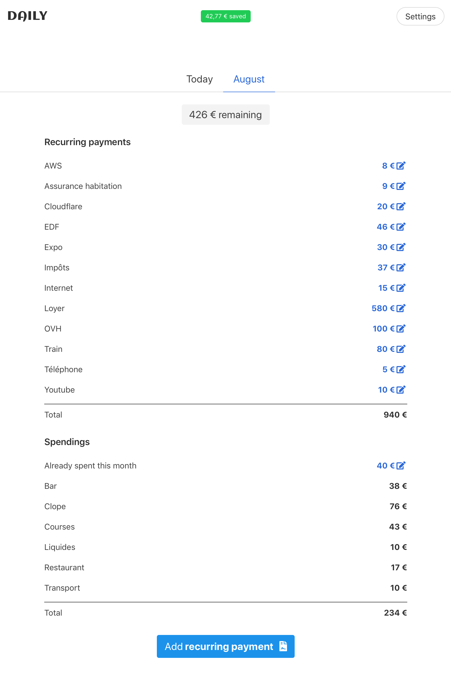

# Daily

Daily helps you manage your monthly budget on a day-to-day basis. Set your maxium monthly budget, your fixed cost and it will tell you how much you can spend and how much you saved.



## Configuration

You will need to fill up all this variable in `.env` file:

```
DATABASE_URL=postgres:///AAA
GOOGLE_CLIENT_ID=BBB
GOOGLE_CLIENT_SECRET=CCC
```

